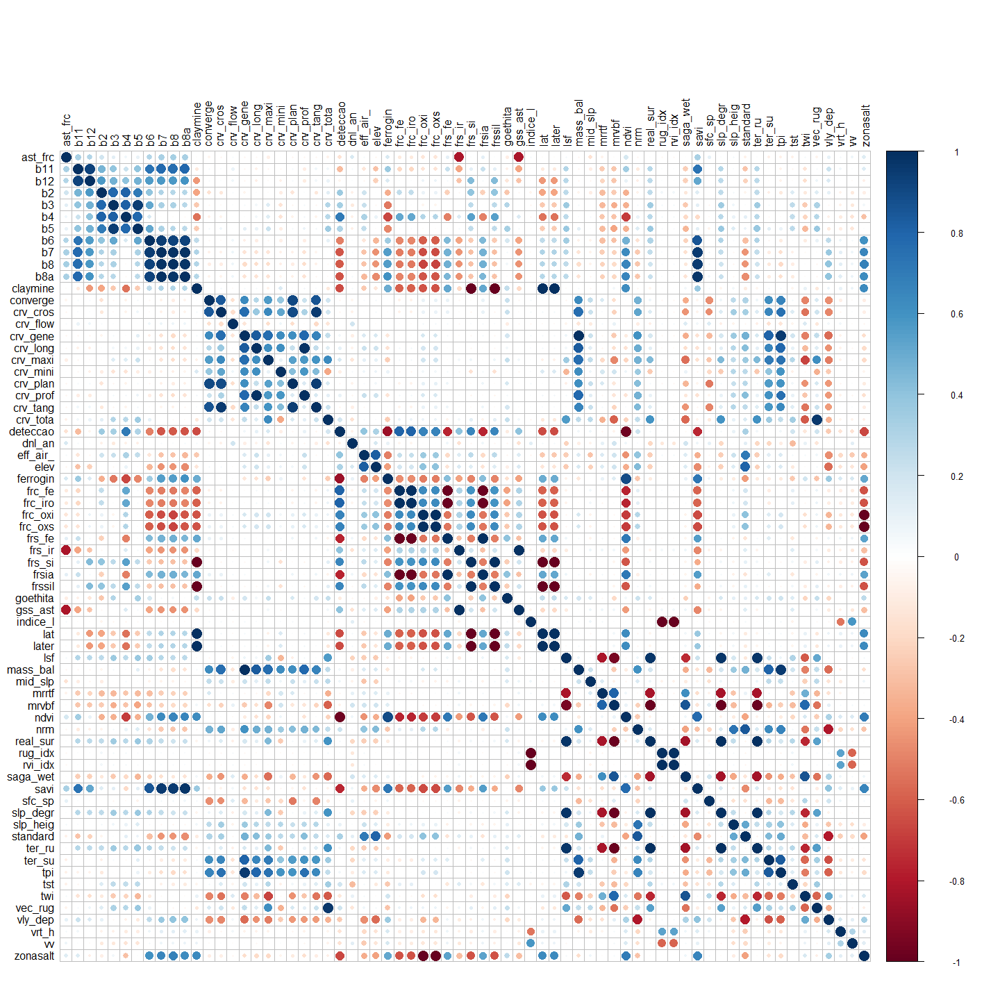

#### 🌍 ─────────────────────────────────────────────── 🌍

#### 🌍 THERESA ROCCO PEREIRA BARBOSA

#### 🌍 Brasileira \| Geocientista \| Dados

#### 🌍 <imakemapas@outlook.com.br> \| +55 24 998417085

#### 🌍 2025-06-16

#### 🌍 ─────────────────────────────────────────────── 🌍

<br>

##### Script: Seleção de Variáveis

##### Descrição: Este script carrega um shapefile de pontos contendo informações numéricas extraídas de uma série de imagens raster (covariáveis). As estratégias utilizadas foram: remoção das variáveis altamente correlacionadas e das covariáveis com variância zero ou próxima de zero.

<br>

#### 1. Configuração Inicial ————————————————-

``` r
# Limpar ambiente
rm(list = ls(all.names = TRUE))

# Carregar bibliotecas necessárias
library(terra)     # Para manipulação de dados raster e vetoriais
library(dplyr)     # Para manipulação de dados
library(caret)
```

``` r
# Carregar o arquivo .RData com os dados extraídos na etapa anterior
load("../data/dados_extract.RData")

dfextract <- dfextract |> 
  dplyr::mutate(Subclasses = as.factor(Subclasses)) |> 
  dplyr::mutate(geol = as.factor(geol)) |> 
  dplyr::select(-asp)

# Verifica se o objeto foi carregado corretamente
str(dfextract)
```

    ## 'data.frame':    657 obs. of  80 variables:
    ##  $ Subclasses: Factor w/ 4 levels "laterite","marginal lake",..: 4 4 4 4 4 4 4 4 4 4 ...
    ##  $ x         : num  758370 758370 760370 760370 760370 ...
    ##  $ y         : num  31610 31590 29470 29450 29430 ...
    ##  $ Lat       : num  758370 758370 760370 760370 760370 ...
    ##  $ Long      : num  1e+07 1e+07 1e+07 1e+07 1e+07 ...
    ##  $ ast_frc   : num  1.9 1.88 2 1.93 1.93 ...
    ##  $ b11       : num  0.171 0.171 0.183 0.183 0.185 ...
    ##  $ b12       : num  0.0732 0.0732 0.079 0.079 0.0793 ...
    ##  $ b2        : num  0.0274 0.0274 0.03 0.03 0.0273 ...
    ##  $ b3        : num  0.0492 0.0492 0.0524 0.0524 0.0479 ...
    ##  $ b4        : num  0.026 0.026 0.0294 0.0294 0.0249 ...
    ##  $ b5        : num  0.0852 0.0852 0.09 0.09 0.0838 ...
    ##  $ b6        : num  0.234 0.234 0.249 0.249 0.248 ...
    ##  $ b7        : num  0.29 0.29 0.323 0.323 0.309 ...
    ##  $ b8        : num  0.289 0.289 0.326 0.326 0.303 ...
    ##  $ b8a       : num  0.322 0.322 0.359 0.359 0.347 ...
    ##  $ claymine  : num  2.33 2.33 2.31 2.31 2.33 ...
    ##  $ converge  : num  2.37 37.07 -3.39 -1.78 -1.54 ...
    ##  $ crv_cros  : num  -0.000311 0.00062 -0.000263 -0.000275 -0.000232 ...
    ##  $ crv_flow  : num  1.58e-09 2.60e-09 1.67e-08 6.81e-08 9.07e-08 ...
    ##  $ crv_gene  : num  0.000186 0.000415 -0.001032 -0.001003 -0.000872 ...
    ##  $ crv_long  : num  0.000497 -0.000205 -0.000769 -0.000728 -0.000639 ...
    ##  $ crv_maxi  : num  4.36e-04 5.04e-04 5.63e-06 1.03e-05 -3.23e-06 ...
    ##  $ crv_mini  : num  -0.000343 -0.000297 -0.000522 -0.000512 -0.000433 ...
    ##  $ crv_plan  : num  -0.062435 0.114313 -0.000893 -0.002762 -0.002391 ...
    ##  $ crv_prof  : num  0.000308 -0.000251 -0.000501 -0.000431 -0.000357 ...
    ##  $ crv_tang  : num  -2.14e-04 4.58e-04 -1.53e-05 -6.98e-05 -7.82e-05 ...
    ##  $ crv_tota  : num  1.76e-07 3.25e-07 2.57e-07 2.14e-07 1.48e-07 ...
    ##  $ deteccao  : num  0.111 0.111 0.118 0.118 0.101 ...
    ##  $ dnl_an    : num  -0.000333 -0.004002 -0.007502 -0.013022 -0.019294 ...
    ##  $ eff_air_  : num  351 348.5 10.2 10.4 10.7 ...
    ##  $ elev      : num  300.5 300.6 60.2 60.5 61 ...
    ##  $ ferrogin  : num  6.54 6.54 6.85 6.85 7.23 ...
    ##  $ frc_fe    : num  0.528 0.528 0.561 0.561 0.52 ...
    ##  $ frc_iro   : num  0.528 0.528 0.561 0.561 0.52 ...
    ##  $ frc_oxi   : num  0.59 0.59 0.56 0.56 0.611 ...
    ##  $ frc_oxs   : num  0.59 0.59 0.56 0.56 0.611 ...
    ##  $ frs_fe    : num  2.15 2.15 2.02 2.02 2.19 ...
    ##  $ frs_ir    : num  0.604 0.618 0.591 0.618 0.607 ...
    ##  $ frs_si    : num  0.429 0.429 0.433 0.433 0.429 ...
    ##  $ frsia     : num  2.15 2.15 2.02 2.02 2.19 ...
    ##  $ frssil    : num  0.429 0.429 0.433 0.433 0.429 ...
    ##  $ geol      : Factor w/ 39 levels "1","2","2.02490496635437",..: 2 2 1 1 1 1 1 1 1 1 ...
    ##  $ goethita  : num  1.8 1.8 1.75 1.75 1.75 ...
    ##  $ gss_ast   : num  0.604 0.618 0.591 0.618 0.607 ...
    ##  $ hl        : num  0 0 0 0 0 0 0 0 0 0 ...
    ##  $ hl_idx    : num  0 0 0 0 0 0 0 0 0 0 ...
    ##  $ indice_l  : num  2.01 1.12 1.89 4.01 2.9 ...
    ##  $ lat       : num  2.33 2.33 2.31 2.31 2.33 ...
    ##  $ later     : num  2.33 2.33 2.31 2.31 2.33 ...
    ##  $ lsf       : num  4.31e-02 1.89e-02 6.67e-05 7.90e-05 1.27e-04 ...
    ##  $ mass_bal  : num  0.00924 0.02032 -0.04901 -0.04766 -0.04166 ...
    ##  $ mid_slp   : num  0.0349 0.033 0.9715 0.9715 0.9707 ...
    ##  $ mrrtf     : num  0.0844 1.682 0.1341 0.2909 0.3229 ...
    ##  $ mrvbf     : num  2.83 2.82 3.89 3.71 2.44 ...
    ##  $ ndvi      : num  0.835 0.835 0.835 0.835 0.848 ...
    ##  $ nrm       : num  0.5174 0.5165 0.0142 0.0143 0.0146 ...
    ##  $ real_sur  : num  400 400 400 400 400 ...
    ##  $ rug_idx   : num  0.497 0.89 0.53 0.249 0.344 ...
    ##  $ rvi_idx   : num  1.329 1.884 1.386 0.798 1.025 ...
    ##  $ saga_wet  : num  8.79 8.63 10.25 10.14 10.02 ...
    ##  $ savi      : num  0.523 0.523 0.556 0.556 0.554 ...
    ##  $ sfc_sp    : num  1 -2 1 0 0 ...
    ##  $ slp_degr  : num  0.197 0.23 0.982 1.447 1.874 ...
    ##  $ slp_heig  : num  54.02 53.72 3.08 2.93 2.81 ...
    ##  $ slp_idx   : num  1 1 1 1 1 1 1 1 1 1 ...
    ##  $ standard  : num  183.9 183.7 58.9 58.9 58.9 ...
    ##  $ ter_ru    : num  0.0637 0.0565 0.2221 0.3239 0.4165 ...
    ##  $ ter_su    : num  50.1486 45.8391 0 0.0787 0.63 ...
    ##  $ tpi       : num  0.13 0.155 -0.555 -0.584 -0.543 ...
    ##  $ tst       : num  0.1046 0.0605 0 0 0 ...
    ##  $ twi       : num  16.4 7.7 12 12.9 13 ...
    ##  $ vec_rug   : num  1.57e-05 4.69e-05 2.48e-05 1.54e-05 1.17e-05 ...
    ##  $ vly       : num  0 0 0 0 0 0 0 0 0 0 ...
    ##  $ vly_dep   : num  50.4 50.3 213.3 202.8 188.9 ...
    ##  $ vly_idx   : num  0 0 0 0 0 0 0 0 0 0 ...
    ##  $ vrt_h     : num  96 146 176 104 144 128 121 158 114 100 ...
    ##  $ vv        : num  193 164 332 417 418 253 239 262 304 160 ...
    ##  $ zonasalt  : num  1.69 1.69 1.79 1.79 1.64 ...
    ##  $ id        : int  1 2 3 4 5 6 7 8 9 10 ...

#### 5. Separação do Dataframe em Variáveis Alvo (y) e Co-Variáveis (x) ——-

``` r
dfy <- dplyr::select(dfextract, any_of(c("id", "geol")), 1:5)      # Variáveis alvo, id, xy e cov factor
dfx <- dfextract |> dplyr::select(-dplyr::all_of(names(dfy)), id)  # demais covariáveis
```

#### 6. Detecção de Variáveis com Variância Zero ou Quase Zero —————-

``` r
nzv <- caret::nearZeroVar(dfx, names = TRUE)
dfnz <- dfx
if (length(nzv) > 0) {
  dfnz <- dfx |> dplyr::select(-dplyr::one_of(nzv))
  print(paste("Eliminadas por variância zero ou próximo de zero:", paste(nzv, collapse = ", ")))
} else {
  print('Não há variáveis com variância zero ou quase zero')
}
```

    ## [1] "Eliminadas por variância zero ou próximo de zero: hl, hl_idx, slp_idx, vly, vly_idx"

#### 7. Detecção de Variáveis Altamente Correlacionadas ———————-

``` r
limiar_correl <- 0.95  # Limiar de correlação para remoção de variáveis

# Calcula a matriz de correlação
mcor <- dfnz |> 
  dplyr::select_if(is.numeric) |>  # Seleciona variáveis numéricas
  dplyr::select(-id) |> 
  scale() |>                       # Escala os dados
  cor(method = "spearman")         # Calcula a matriz de correlação

# Encontra variáveis altamente correlacionadas
vc <- caret::findCorrelation(x = mcor, cutoff = limiar_correl, names = TRUE)

# Cria a figura da matriz de correlação
corrplot::corrplot(mcor, method = "circle", tl.col = "black", mar = c(0, 0, 5, 0))
```

<!-- -->

``` r
# Mostra as variáveis altamente correlacionadas
print(vc)
```

    ##  [1] "ndvi"     "savi"     "b8"       "b7"       "frc_oxi"  "frc_oxs"  "frc_fe"   "frc_iro"  "tpi"      "mass_bal" "claymine" "frs_si"  
    ## [13] "lat"      "later"    "mrvbf"    "frsia"    "real_sur" "slp_degr" "ter_ru"   "crv_tota" "crv_cros" "crv_long" "gss_ast"  "rug_idx" 
    ## [25] "rvi_idx"

``` r
png(filename = "matriz_correlacao.png", width = 1200, height = 1200)
corrplot::corrplot(mcor, method = "circle", tl.col = "black", mar = c(0, 0, 5, 0))
dev.off()
```

    ## png 
    ##   2

#### 8. Remoção de Variáveis Altamente Correlacionadas ———————–

``` r
dfcor <- dfnz
if (length(vc) > 0) {
  dfcor <- dfnz |> dplyr::select(-one_of(vc))  # Remove variáveis altamente correlacionadas
  print(paste("Eliminadas por serem altamente correlacionadas:", paste(vc, collapse = ", ")))
} else {
  print('Nenhuma variável foi removida por alta correlação')
}
```

    ## [1] "Eliminadas por serem altamente correlacionadas: ndvi, savi, b8, b7, frc_oxi, frc_oxs, frc_fe, frc_iro, tpi, mass_bal, claymine, frs_si, lat, later, mrvbf, frsia, real_sur, slp_degr, ter_ru, crv_tota, crv_cros, crv_long, gss_ast, rug_idx, rvi_idx"

#### 9. Criação do Dataframe Final ——————————————-

``` r
# Combina as variáveis alvo (y) e as co-variáveis (x) limpas
dffinal <- merge(dfy, dfcor, by = "id", all = TRUE)

# Salva os dados limpos no diretório para modelagem
save(dffinal, file = '../data/dados_limpos.RData')
```
